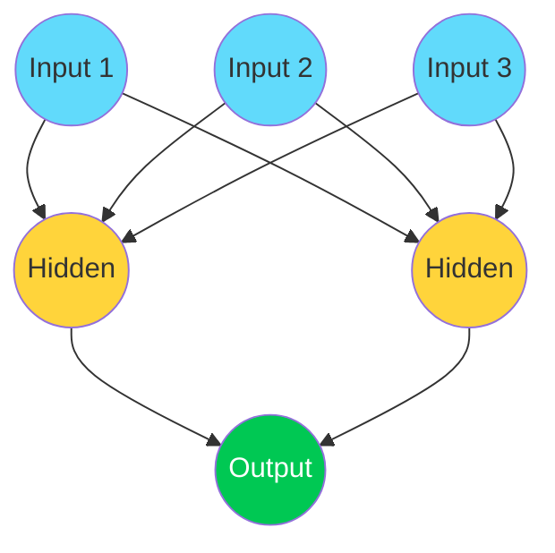

<h1 align="center">
  
</h1>

<p align="center">
  
  
  
</p>

<p align="center">
  <a href="https://linkedin.com/in/your-linkedin"></a>
  <a href="https://twitter.com/your-twitter"></a>
  <a href="mailto:your@email.com"></a>
  <a href="https://your-portfolio.com"></a>
</p>

---

## 🧠 About Me

```yaml
Name: Your Name
Role: Machine Learning Engineer / AI Researcher
Focus: Deep Learning, NLP, LLMs, Transformer Architectures
Currently Exploring: Multimodal Models, RAG Pipelines, Fine-tuning LLMs
Fun Fact: I make neural networks that dream in tensors 🧬
```

---

## 🤖 Machine Learning & AI Expertise

<p align="center">
  
  
  
  
  
  
</p>

### 🔷 Transformer Architecture (self-attention flow)

```mermaid
flowchart LR
    A[Input Tokens] --> B[Embedding + Positional Encoding]
    B --> C[Multi-Head Self-Attention]
    C --> D[Add & Norm]
    D --> E[Feed Forward Network]
    E --> F[Add & Norm]
    F --> G[Stacked x N Encoder Layers]
    G --> H[Decoder: Masked Attention]
    H --> I[Cross Attention]
    I --> J[Output Probabilities - Softmax]

    style A fill:#00F7FF,stroke:#000,color:#000
    style J fill:#FF6F00,stroke:#000,color:#000
```



### 🔷 Neural Network Layers



---

## 🛠️ Tech Stack

<p align="center">
  
</p>

**AI / ML Libraries:**    

---

## 📊 GitHub Stats

<p align="center">
  
  
</p>

<p align="center">
  
</p>

---

## 🐍 Contribution Snake (3D Animated)

<p align="center">
  
</p>

> ⚠️ Ye snake animation ek GitHub Action se auto-generate hoti hai. Setup steps neeche diye hain.

---

## 🏆 GitHub Trophies

<p align="center">
  
</p>

---

## 📈 Activity Graph

<p align="center">
  
</p>

---

<p align="center">
  
</p>
